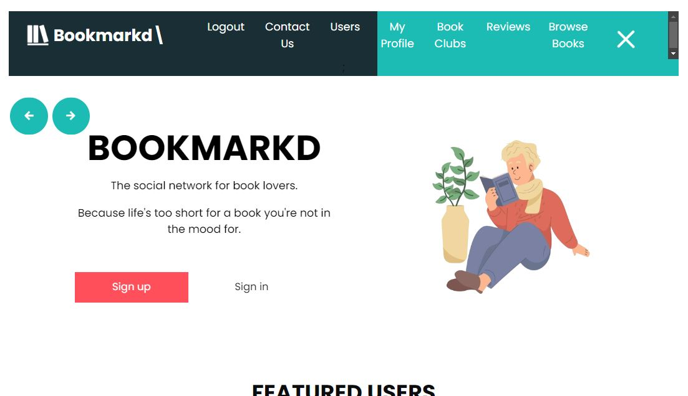

# Bookmarkd

## Description
Bookmarkd is a social media / book review website in the style of Letterboxd but for books instead of movies.  Users will be able to create an account, add books they plan to read to their personal book list, post reviews of books they just finished, search other users and their review history, comment on or like other users’ reviews, and form book clubs with other users currently reading the same book.  The app sources data on the books from the Google Books API and it uses a MongoDB database to store user information. 

## Installation
No installation necessary, this application is available on Render at [Bookmarkd Render Deployment](https://bookmarkd-boln.onrender.com/)

## Usage
Upon visiting the website, this is a screenshot of what the landing page will look like:

At the front page, existing users are able to log in and new users have the option to sign up.  A significant portion of the functionality of the website is available to both logged-in and not logged-in users.  However, given that a not logged-in user will not have a profile on the webpage, they will not be able to create their own reviews or add books to their collections. Instead they can browse books, view other users' profiles, and read reviews made by other users about their recently read books.

## Credits
Co-creators of Bookmarkd: Robin Langton, Domas Dargis, Alexa Chavez, Nate Johnson